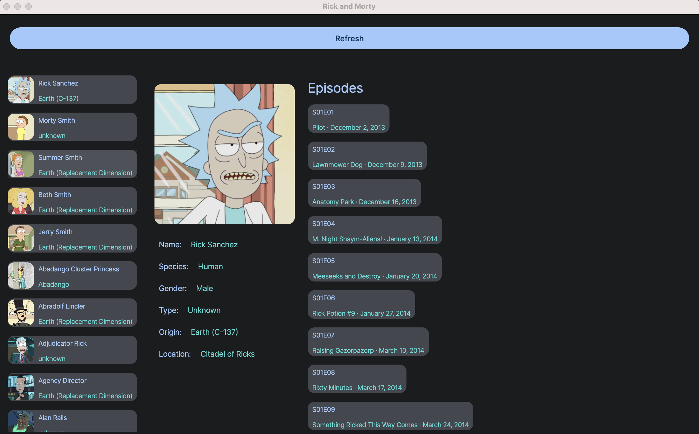

# Rick and Morty 
A sample KMP project using Rick and Morty API

## Screenshots

## Tech Stack
- [Kotlin Multiplatform](https://kotlinlang.org/docs/multiplatform.html)
- [Ktor](https://ktor.io/)
- [Apollo](https://github.com/apollographql/apollo-kotlin) (GraphQL)
- [Coroutines](https://kotlinlang.org/docs/coroutines-overview.html)
- [Jetpack Compose](https://github.com/JetBrains/compose-multiplatform)
- [Koin](https://github.com/InsertKoinIO/koin) (DI)

## Supported platforms
- Android
- iOS
- Web
- Desktop

TBC
